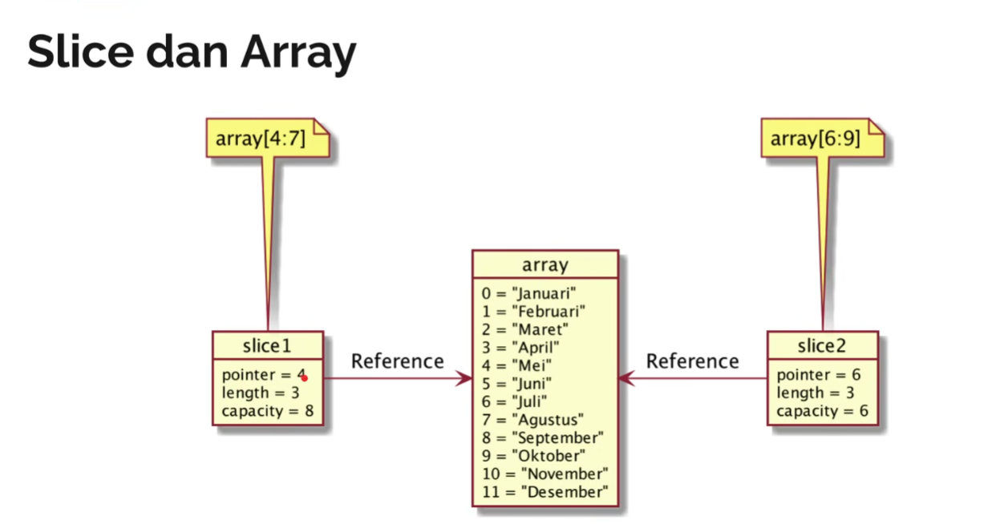

# Go — Data Types

___

### Integer
- `int`   : signed integer (includes negative values)
- `int8`, `int16`, `int32`, `int64` : fixed-size signed integers

### Unsigned Integer
- `uint`  : unsigned integer (excludes negative values)
- `uint8`, `uint16`, `uint32`, `uint64` : fixed-size unsigned integers
---
### Floating-point & Complex
- `float32`, `float64` : decimal numbers
- `complex64`, `complex128` : complex numbers (include imaginary part)
---
### Type Aliases (Built-in)
- `byte` = `uint8`
- `rune` = `int32`
- `int`  : at least 32-bit (commonly 32-bit on 32-bit systems, 64-bit on 64-bit systems)
- `uint` : at least 32-bit (commonly 32-bit on 32-bit systems, 64-bit on 64-bit systems)
---
### Boolean
- `bool` : `true`, `false`
---
### String
- String literals: `"..."`  -> text
- `len(s)` : returns total number of bytes in the string
- Indexing / slicing:
    - `s[i]`      : returns the byte at index `i`
    - `s[x:y]`    : substring from index `x` up to (not including) `y`
    - `s[:y]`     : from start up to `y`
    - `s[x:]`     : from `x` to end
---

### Data Type Conversion

#### Explicit conversion
- Syntax: `type2(valueOfType1)`
- Example:
    - `var number32 int32 = 3278`
    - `var number64 int64 = int64(number32)`

Notes:
- Go does NOT do implicit numeric conversion.
- Conversion is allowed when the target type can represent the value (but overflow can still happen).
- It is not strictly “only go up”; you can convert down as well, but you must be careful about overflow/precision loss.

---

### Type Declaration (Custom Type)

#### Define a new type
- Syntax: `type Name ExistingType`
- Example:
    - `type num int64`
    - `var number num = 64`

---

### Array

#### Many data with same type stored on 1 variable. Using index start from 0 
- Syntax: `var names [n]type || var names =[n]type{data} || var names := [...]types{data}`
- Notes: `n is length of array, not index`
- Example:
  - `var nama [2]string; nama[0] = "Abi"; nama[1] = "Manyu"; nama[2] = "James"`
  - `var values = [2]int{1,2}`
  - `var time := [...] string{1,2,3...}`
- Function:
  - `longName := len(name)` Length an array
  - `nValues := values[0]`  Data in array index n
  - `values[1] = 100`       Change a data in index n
---

### Slice

#### Dynamic total of data
- Syntax: 
  - `array[low:high];`  make a slice start index from low to high
  - `array[low:];`    make a slice start index from low to last
  - `array[:high];` make a slice start index from 0 to before high
  - `array[:]` make a slice start index from 0 to last
- Example:
  - `type num int64`
  - `var number num = 64`
- Function:
  - `len(slice)` Length a slice
  - `cap(slice)` Capacity of a slice
  - `append(slice, data)` Make a new slice with adding data to last position slice(if full, make a new array)
  - `make([]types, length, capacity)` Make a new slice
  - `copy(destination, source)` Copying slice from source to destination

